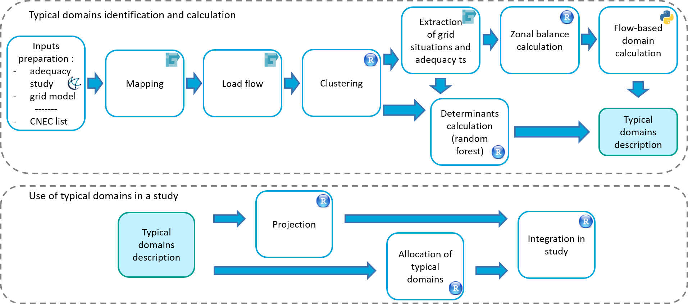

# PORYGON

## About Porygon
Porygon is a methodology aiming at computing and visualising flow-based domains for prospective studies. It is based on Python and R code which has been published open-source under the MPL-2.0 license.

## Overview of the methodology
Porygon allows to calculate prospective Flow-Based domains which are compliant with the operational Core Flow-Based capacity calculation methodology. The tool takes as input a prospective market study and a prospective detailed grid model, and calculates a number of typical domains which can then be allocated to an adequacy study.

The diagram below summarizes the Porygon methodology steps:

## Content of the repository
The repository contrains the following folders:
* **R** contains the R code used for load-flow clustering, zonal balance calculation, determinants calculation, and integration in a study. It also contains additional functions to draw domain projections in a 2-D space.
* **python** contains the python scripts used for the Flow-Based domain calculation process and metrics computation.